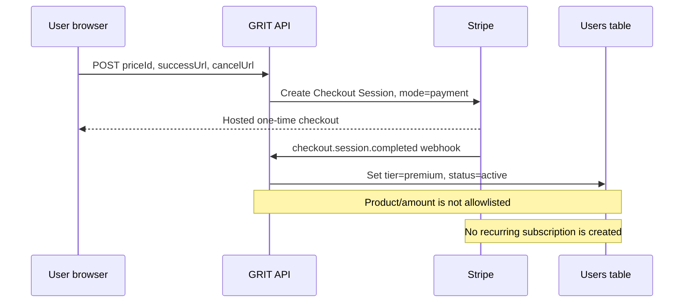
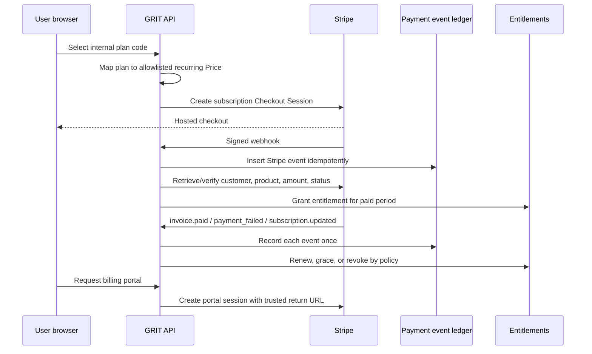
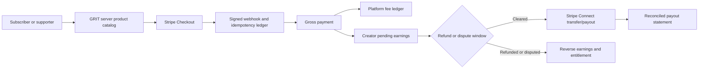
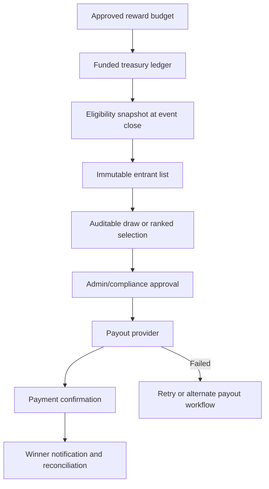

# Payment Flow Diagrams

## Current platform checkout

This flow is unsafe because the browser selects the Stripe Price and redirects, while a one-time success grants subscription-like access.

## Required platform subscription flow

## Required creator payment flow

No box after “GRIT server product catalog” is currently implemented for creator payments. Split percentages in prose must not substitute for ledger entries and Connect transfers.

## Required reward flow

Raffle code remains incomplete and is no longer invoked during event close; it does not provide funded entry, disbursement, or reconciliation lifecycle. Monthly bonus code selects winners and creates pending records only when an undeployed table and feature flag are enabled.
